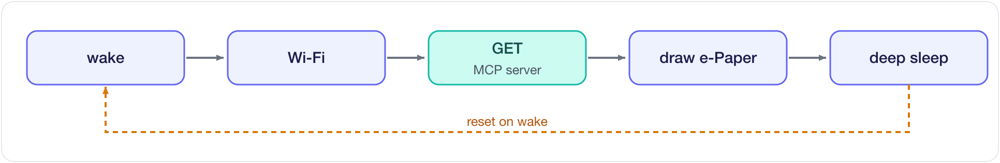
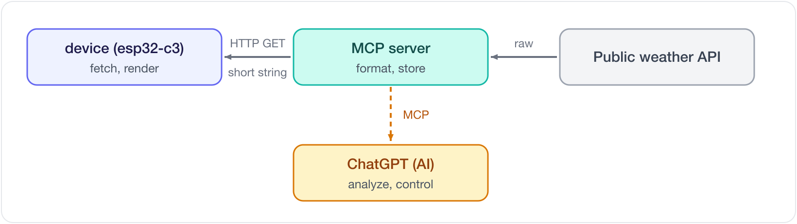

[English](README.md) | [한국어](README.ko.md)

# eink-weather-display

**ESP32-C3 + 1.54" e-Paper 저전력 날씨 표시기.**
서버(MCP)에서 정제된 날씨를 HTTP로 수신 → e-ink 렌더링 → 딥슬립. 배터리로 수개월.

> Topics: `esp32-c3` · `e-ink` · `mcp` · `battery`

## 동작 흐름 (5조각)


- 모든 작업 `setup()`, `loop()` 비움 (웨이크 = 리셋)
- e-ink 쌍안정 → 화면 유지 전류 0, 갱신 순간만 소비
- 상태 유지 필요 시 `RTC_DATA_ATTR`

## 데이터 파이프라인


- 정제 = 서버 담당 → 기기 경량 (RAM·전력 절약)
- 기기: HTTPS GET 하나. AI 분석·제어 = 선택 경로

## 하드웨어
| 부품 | 사용 |
|---|---|
| MCU | ESP32-C3 (XIAO ESP32-C3 / Super Mini) |
| 디스플레이 | Waveshare 1.54" e-Paper (SSD1681, 200×200, 흑백) |
| 프레임워크 | Arduino (PlatformIO) |
| 전원 | LiPo — 딥슬립으로 수개월 |

## 배선 (`src/config.h`)
두 보드 **GPIO 번호 동일**(코드 같음) — 물리 핀 라벨만 다름.

| e-Paper | GPIO | Super Mini 핀 | XIAO 라벨 |
|---|---|---|---|
| VCC | — | 3V3 | 3V3 |
| GND | — | GND | GND |
| DIN (MOSI) | 7 | GPIO7 | D5 |
| CLK (SCK) | 6 | GPIO6 | D4 |
| CS | 10 | GPIO10 | D10 |
| DC | 5 | GPIO5 | D3 |
| RST | 4 | GPIO4 | D2 |
| BUSY | 3 | GPIO3 | D1 |

- Super Mini는 핀에 GPIO 번호 직접 표기, XIAO는 `D0–D10`(보드 위치 이름, GPIO와 매핑 다름)
- ⚠️ C3 기본 SPI핀(SCK=4·MISO=5) ↔ RST(4)/DC(5) 충돌 → `display.cpp`에서 SPI 재지정 후 핀 재확정

## 설정 (secrets)
WiFi 값 = `secrets.h` (git 제외). 클론 후:
```bash
cp src/secrets.example.h src/secrets.h   # WIFI_SSID / WIFI_PASSWORD 입력
```

## 빌드 & 업로드
```bash
pio run -t upload
pio device monitor -b 115200
```
- 딥슬립 펌웨어 업로드 후 재업로드 = BOOT 누른 채 RESET (다운로드 모드)

## 구조
```
src/
├─ config.h         설정 (URL · 핀 · 주기)
├─ net.h / .cpp     WiFi 연결 + HTTP GET
├─ display.h / .cpp e-Paper 초기화 + 렌더링 (전역 객체 static 캡슐화)
├─ weather_icons.h  날씨 아이콘 비트맵
└─ main.cpp         흐름 (setup/loop)
```

## 참고 (스터디)
- 딥슬립 = 리셋 → `setup()` 재시작, `loop()` 미사용
- SPI 충돌 회피: `SPI.begin(6, -1, 7, 10)` 후 핀 OUTPUT 재확정 + 수동 리셋
- 날씨 조건 문자열(`뇌우`·`눈`·`비`…) = 서버 응답 매칭용, 코드에 한국어 유지

## 서버 (MCP)
날씨·LED 백엔드 = 별도 프로젝트: **[seung-gu/emcp](https://github.com/seung-gu/emcp)**

- 기기: 평문 HTTPS GET 엔드포인트만
- 동일 서버 MCP 노출 → AI(ChatGPT 등) 조회·제어
