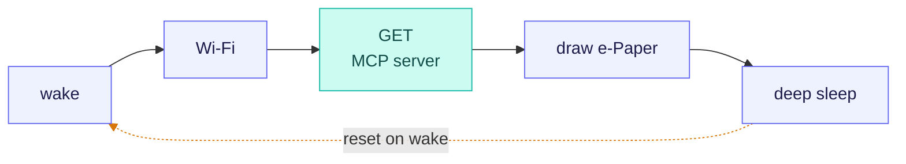
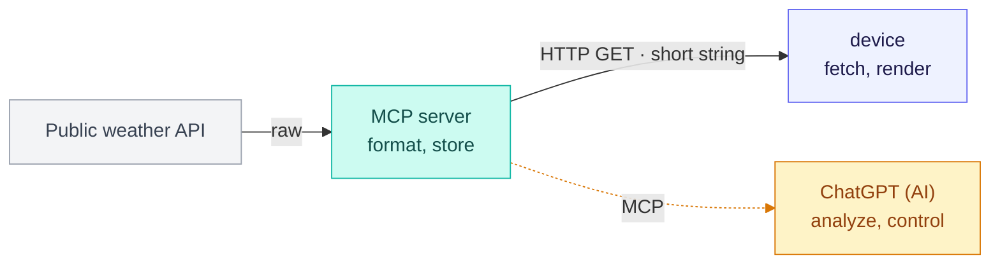

[English](README.md) | [한국어](README.ko.md)

# eink-weather-display

A low-power weather display built with an **ESP32-C3 + 1.54" e-Paper**.
Fetches pre-formatted weather from a server (MCP) over HTTP, renders it on e-ink, then deep-sleeps — running for months on a battery.

> Topics: `esp32-c3` · `e-ink` · `mcp` · `battery`

## Runtime (5 steps)


- Everything in `setup()`, `loop()` empty (a wake is a full reset)
- Bistable e-ink → 0 current to hold the image, draws only on refresh
- Persist state across sleeps with `RTC_DATA_ATTR`

## Data pipeline


- Formatting is server-side → the device stays light (less RAM/power)
- Device: one HTTPS GET; AI analyze/control is an optional path

## Hardware
| Part | Used |
|---|---|
| MCU | ESP32-C3 (Seeed XIAO ESP32-C3 or ESP32-C3 Super Mini) |
| Display | Waveshare 1.54" e-Paper (SSD1681, 200×200, black/white) |
| Framework | Arduino (PlatformIO) |
| Power | LiPo battery — months on deep sleep |

## Wiring (Super Mini · `src/config.h`)
| e-Paper | ESP32-C3 |
|---|---|
| VCC | 3V3 |
| GND | GND |
| DIN (MOSI) | GPIO7 |
| CLK (SCK) | GPIO6 |
| CS | GPIO10 |
| DC | GPIO5 |
| RST | GPIO4 |
| BUSY | GPIO3 |

- XIAO ESP32-C3: pin labels (D0–D10) differ in position only; adjust GPIO numbers in `config.h`
- ⚠️ The C3's default SPI pins (SCK=4 / MISO=5) collide with RST(4)/DC(5) → `display.cpp` remaps SPI and re-asserts the pins

## Setup (secrets)
Wi-Fi values live in `secrets.h` (not committed). After cloning:
```bash
cp src/secrets.example.h src/secrets.h   # then fill in WIFI_SSID / WIFI_PASSWORD
```

## Build & Upload
```bash
pio run -t upload
pio device monitor -b 115200
```
- After flashing the deep-sleep firmware, re-uploads need download mode: hold **BOOT**, tap **RESET**

## Layout
```
src/
├─ config.h         all settings (URLs · pins · intervals)
├─ net.h / .cpp     Wi-Fi connect + HTTP GET
├─ display.h / .cpp e-Paper init + rendering (globals kept static = encapsulated)
├─ weather_icons.h  weather icon bitmaps
└─ main.cpp         flow only (setup/loop)
```

## Server (MCP)
The weather/LED backend is a companion project: **[seung-gu/emcp](https://github.com/seung-gu/emcp)**.

- The device only hits a plain HTTPS GET endpoint
- The same server is exposed over MCP, so an AI client (e.g. ChatGPT) can query and control it
