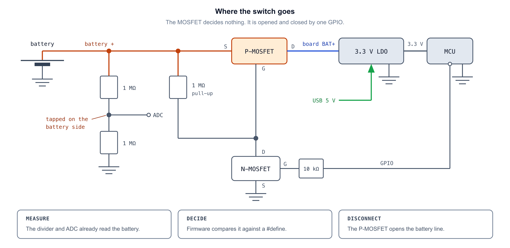
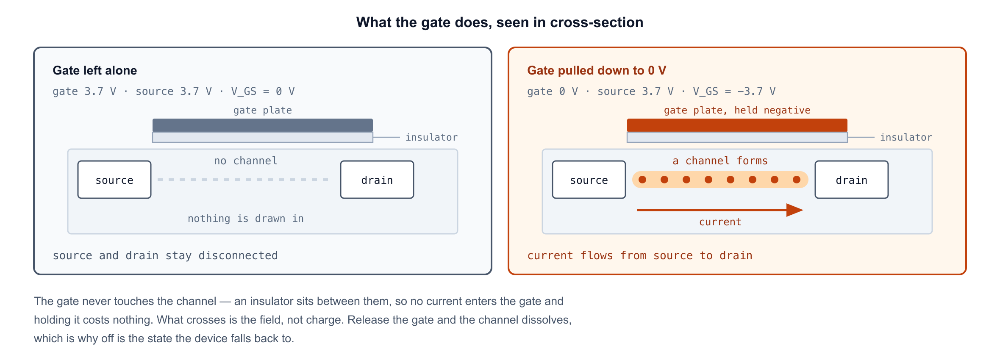
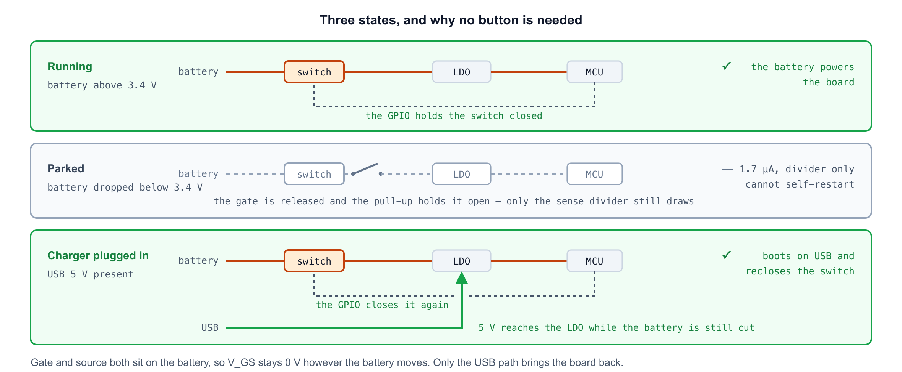

[English](battery-cutoff.md) | [한국어](battery-cutoff.ko.md)

# 저전압에서 배터리 차단하기

딥슬립은 꺼진 상태가 아니다. 칩은 계속 전류를 먹고, 배터리가 비고 나면 그 전류가 **소비의 전부**가
된다 — 묻어버릴 wake가 없기 때문이다. 그대로 두어 배터리가 3.0V 아래로 내려가면 용량이 영구적으로 준다.

이 문서는 배터리를 아예 떼어내고, 충전기를 꽂으면 스스로 돌아오는 회로를 정리한다. 펌웨어에는
들어가 있지 않다. 이유는 §7에 있다.

---

## 1. 각자의 역할

문턱값은 소프트웨어에 있다. MOSFET은 스위치일 뿐이다.

| | |
|---|---|
| 분압 + ADC | 배터리 전압을 **측정** (이미 있음, `battery.cpp`) |
| 펌웨어 | `#define` 값과 비교해 **판단** |
| P-MOSFET | 배터리를 **차단** |

컷오프를 3.4V에서 3.3V로 바꾸는 건 숫자 하나와 재플래싱이다. 부품은 그대로다.

---

## 2. 회로



분압은 **스위치보다 앞**에서 딴다. 뒤에서 따면 차단된 배터리가 0V로 읽혀서, USB로 깨어났을 때
방전된 배터리와 충전된 배터리를 구분할 수 없다.

---

## 3. 게이트를 풀업해야 하는 이유

P-MOSFET은 게이트가 소스보다 낮을 때 통한다. 대략 1V 이상 낮아야 한다. 소스는 배터리에 묶여 있으므로:

| 게이트 | V_GS | |
|---|---|---|
| 떠 있음, 풀업이 배터리 +로 끌어올림 | 0V | **꺼짐** |
| 0V로 잡힘 | −3.7V | **켜짐** |



게이트는 스스로 전압을 갖지 못한다. 절연막 위에 얹힌 판이라 전류가 들어가지도, 어딘가에 머물지도
않는다. 풀업이 없으면 떠 있게 되고, 떠 있는 게이트는 잡음에 따라 켜졌다 꺼졌다 한다. 풀업은
**아무도 구동하지 않을 때 꺼짐으로 떨어지도록** 만든다. MCU가 사라진 뒤 원하는 상태가 바로 그것이다.

**1MΩ은 위아래로 다 막혀 있다.** 너무 낮으면 스위치가 켜져 있는 동안 계속 전류를 버린다 —
10kΩ이면 370µA로, 딥슬립 전류보다 크다. 너무 높으면 누설이 이긴다. N채널의 off 누설과 P채널의
게이트 누설을 합쳐 수백 nA가 풀업에 전압을 만드는데, 10MΩ이면 약 2V가 되어 문턱을 넘긴다. 차단이
안 된다.

---

## 4. 트랜지스터가 둘인 이유

만충 배터리는 4.2V고 GPIO 정격은 3.3V다. 게이트를 핀에 직결하면 차단된 상태에서 4.2V가 핀의 보호
다이오드로 역류한다.

작은 N-MOSFET이 둘을 갈라놓는다. N채널의 게이트는 GPIO만 보고, 드레인은 P채널 게이트만 본다.
두 전압 영역이 닿는 지점이 없다.

---

## 5. 끄는 순서

게이트를 놓으면 전원이 내려간다. 디커플링 콘덴서가 1ms 남짓을 벌어주는데, 끝나지 않은 플래시
쓰기를 깨뜨리기엔 충분하고 뭔가 해내기엔 모자란 시간이다. 남겨야 할 것을 전부 먼저 처리한다:

1. 배터리 소진 화면을 그린다 — e-Paper는 전원 없이도 마지막 화면을 유지한다
2. `prefs.putBool("parked", true)` 후 `prefs.end()`
3. `Serial.flush()`
4. `digitalWrite(PWR_HOLD, LOW)` — 여기서 전원이 끊긴다

---

## 6. 꺼진 채로 있는 이유, 그리고 돌아오는 길



게이트와 소스가 둘 다 배터리에 붙어 있어서 **배터리가 어떻게 변하든 V_GS는 0V**다. 부하가 빠져 배터리가
3.5V로 회복해도 두 단자가 같이 올라가므로 아무것도 바뀌지 않는다. MCU는 전원이 없어 게이트를
내리지 못한다. 스스로 켜지는 경로가 없다.

하나만 예외다. 보드의 레귤레이터는 배터리뿐 아니라 USB 5V로도 돈다.

```
USB 꽂음  →  레귤레이터가 5V로 동작  →  MCU 부팅 (배터리는 아직 차단)
          →  setup() 이 GPIO를 잡음   →  스위치 닫힘  →  충전 시작
```

충전기가 곧 전원 버튼이고, 따로 달 것이 없다.

꺼진 상태를 유지하는 비용은 거의 없지만 완전히 0은 아니다. 전원 없는 게이트를 붙잡는 풀업에는
전류가 안 흐르지만, 분압은 스위치 **앞**에 있다 — 차단된 뒤에도 배터리를 읽을 수 있는 이유가
그것이다 — 그래서 배터리에 영원히 걸린 채 3.4V ÷ 2MΩ = **1.7µA**를 끌어간다. 1.2mAh에 한 달이고,
3.4V에서 남은 용량이 10~15mAh이니 방치된 보드는 1년쯤이면 스스로 비운다. 이 회로가 없앨 수 없는
유일한 누설이다. 분압을 스위치 뒤로 옮기면 사라지지만 측정도 같이 사라진다.

---

## 7. 펌웨어에 없는 이유

**쓸 핀이 없다.** 남은 건 D6(GPIO21)인데 UART0 TX라 부팅할 때마다 ROM 부트로더가 이 핀을 구동한다.
배터리로 돌다가 리셋이 걸리면 ROM이 게이트를 흔드는 동안 보드가 부팅을 마치기도 전에 자기 전원을
끊을 수 있다.

극성은 이미 유리하다. 이 회로는 액티브 하이라, 유휴 상태가 HIGH인 UART 선은 스위치를 닫힌 채로
둔다. ROM이 실제로 보내는 건 고정 레벨이 아니라 데이터지만, 게이트 정전용량에 대한 1MΩ의 시정수는
비트 속도를 따라갈 만큼 빠르지 않다 — 다만 이건 논증이지 측정이 아니라서 확인이 필요하다. 게이트에
콘덴서를 더하면 여유가 넓어진다. 나머지 빈 핀(GPIO2·8·9)은 스트래핑 핀이라 더 나쁘다.

기판을 뜨면 해결된다. 배선이 고정되면 핀을 주워 쓰지 않고 골라 쓸 수 있다.

---

## 8. 부품

| | |
|---|---|
| P채널 MOSFET | 로직 레벨, 예: AO3401 |
| N채널 MOSFET | 소신호, 예: 2N7002 |
| 저항 | 1 MΩ — 풀업, 기본 상태를 꺼짐으로 |
| 저항 | 10 kΩ — 게이트 직렬, GPIO 보호 |
| GPIO | 1개 |

전용 로드 스위치(TPS22860 등)를 쓰면 위 네 부품을 하나로 대체한다. 정지전류가 nA 단위고, 인에이블
입력이 훨씬 큰 풀업을 견딘다.
