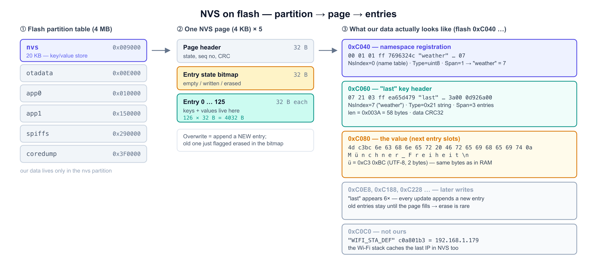

[English](nvs-internals.md) | [한국어](nvs-internals.ko.md)

# What NVS actually writes to flash

`prefs.putString("last", w)` is three lines of code. This is what it looks like on the chip —
dumped from the real device, not from documentation.

See [Persistence & refresh](persistence-and-refresh.md) for *why* we store the weather in NVS.

---

## Layout



| Level | What it is |
|---|---|
| **Partition** | `nvs` at flash `0x9000`, 20 KB — a region reserved in the partition table |
| **Page** | 4 KB each, 5 of them: header (32 B) + entry state bitmap (32 B) + 126 entries |
| **Entry** | 32 B. Holds a key and, for small values, the value itself |

---

## Reproducing the dump

Serial port must be free (close the PlatformIO monitor and any debug session first):

```bash
# 1. dump the 20 KB nvs partition
python $(find ~/.platformio/packages/tool-esptoolpy -name esptool.py) \
  --chip esp32c3 --port /dev/cu.usbmodem11401 \
  read_flash 0x9000 0x5000 nvs.bin

# 2. find our strings (offsets are relative to the partition; add 0x9000 for the flash address)
grep -abo "weather" nvs.bin     # namespace  -> 12360 (0x3048) -> flash 0xC048
grep -abo "last"    nvs.bin     # key        -> six hits
xxd -s 0x3040 -l 128 nvs.bin    # read the raw entries
```

---

## The 32-byte entry

```
byte  0      NsIndex     namespace number (not the name!)
byte  1      Type        0x21 = string, 0x01 = uint8, …
byte  2      Span        how many 32 B slots this item occupies
byte  3      ChunkIndex
bytes 4–7    CRC32
bytes 8–23   Key         16 B, NUL-padded
bytes 24–31  Data        small values inline; large ones store length + CRC here
```

## Namespace → number

The namespace string is stored **once**, in a special entry with `NsIndex = 0`:

```
0xC040:  00 01 01 ff  7696324c  "weather" 00…  07
         │  │  │       │         │              └─ value: 7
         │  │  │       │         └─ Key = "weather"
         │  │  │       └─ CRC32
         │  │  └─ Span = 1
         │  └─ Type = 0x01 (uint8)
         └─ NsIndex = 0  → this is the namespace name table
```

Every later entry then refers to it by that single byte — which is why `"weather"` appears
once in the dump while `"last"` appears many times.

## Our key and value

```
0xC060:  07 21 03 ff  ea65d479  "last" 00…  3a 00 ff ff  0d926a00
         │  │  │                 │           │            └─ CRC32 of the data
         │  │  │                 │           └─ length = 0x003A = 58 bytes
         │  │  │                 └─ Key = "last"
         │  │  └─ Span = 3  (this header + 2 data slots)
         │  └─ Type = 0x21 (string)
         └─ NsIndex = 7  → "weather"

0xC080:  4d c3bc 6e 63 68 6e 65 72 20 46 72 65 69 68 65 69 74 0a
          M  ü    n  c  h  n  e  r     F  r  e  i  h  e  i  t  \n
0xC090:  31 36 c2b0 43 0a  ed9d90 eba6bc 0a  …
          1  6  °    C  \n   흐     림    \n
```

`ü` is `0xC3 0xBC` and `°` is `0xC2 0xB0` — UTF-8, two bytes each, exactly the same bytes the
debugger shows in RAM. Nothing is re-encoded on the way to flash.

---

## Why writes are cheap

`"last"` appears **six times** in the dump — at `0xC068`, `0xC0E8`, `0xC188`, `0xC228`,
`0xC2E8`, `0xC388`. Every update **appended a new entry** instead of overwriting:

| | |
|---|---|
| Update a value | write a new entry, flag the old one *erased* in the page bitmap |
| Erase a sector | only when a page has no free entries left |
| Same value written again | skipped entirely by NVS |

NOR flash can only clear bits in place, so overwriting would mean erasing the whole 4 KB page.
Appending avoids that, which is what makes ~144 writes/day survivable for decades — see the
[wear numbers](persistence-and-refresh.md#flash-wear).

---

## Not ours

```
0xC0C0:  06 04 01 ff  a16e5ce3  "WIFI_STA_DEF" 00…  c0 a8 01 b3
                                                      192 168  1  179
```

The Wi-Fi stack keeps its own NVS entries, including the last IP address. That cache is part
of why a reconnect to a known AP can complete in ~140 ms.

---

## Notes

- The NVS data area is **not memory-mapped**. Code and constants are readable in GDB at
  `0x42000000` (IROM) / `0x3C000000` (DROM), but NVS is reached through the flash driver only —
  `x/ 0x9000` in GDB is meaningless.
- The API deliberately hides addresses: NVS moves entries around, so there is no `getAddress()`.
  The dump above is the only way to see where a value physically sits.
- A normal firmware upload does not touch this partition. `pio run -t erase` does.
