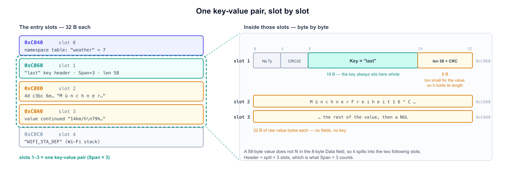
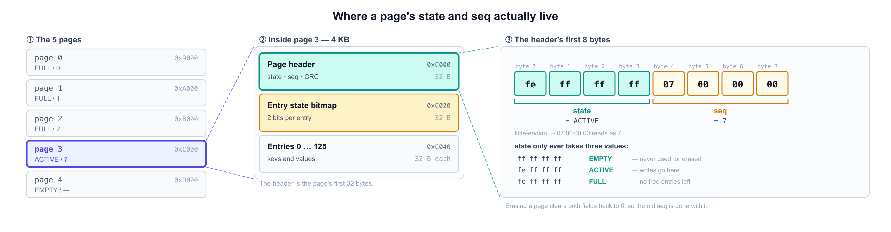

[English](nvs-internals.md) | [한국어](nvs-internals.ko.md)

# Storing state in NVS

The firmware wakes on a timer, fetches once, draws, and deep-sleeps again — and a deep-sleep wake
restarts at `setup()` with ordinary RAM gone. The last good response therefore has to be read back
from storage on every wake. It lives in NVS.

Values below come from one device's dump and are marked "in this dump". Anything unmarked is fixed
by the NVS format itself.

Related: [Persistence & refresh](persistence-and-refresh.md).

---

## 1. Why not RTC memory

RTC SRAM survives deep sleep, but not the reset button, a re-flash or a power cut — all routine
during development. NVS survives all of them, at the cost of flash erase cycles (§6). Full
comparison and the energy numbers: [Persistence & refresh](persistence-and-refresh.md).

---

## 2. What NVS is

**N**on-**V**olatile **S**torage — a key-value store that ESP-IDF keeps in its own flash partition.
Arduino wraps it as `Preferences`.

It is **not EEPROM**: the ESP32 has none, so NVS writes to the same SPI NOR flash that holds the
firmware. Arduino's `EEPROM` library is a thinner emulation over that same flash. ESP-IDF ships
this storage layer in the box; on MCUs whose vendor does not, wear levelling and page swapping are
the application's problem.

---

## 3. The API

```cpp
prefs.begin("weather", false);          // namespace, false = read-write
prefs.putString("last", value);
String w = prefs.getString("last", ""); // second arg = default when the key is absent
prefs.end();
```

- **The namespace and key are names the developer picks.** Nothing declares them; the first
  `putString()` creates the key.
- Names are capped at 15 characters, a string value at 4000 bytes.

---

## 4. What NVS writes to flash


Four levels, each nested inside the one before it. "Slot" and "entry" below mean the same thing —
one of a page's 126 positions:

| Level | Size | Holds |
|---|---|---|
| Flash chip | 4 MB *(this board)* | all partitions — firmware, filesystem, `nvs` |
| `nvs` partition | 20 KB *(partition table)* | 5 pages *(= size ÷ 4 KB)* |
| Page | 4 KB *(NVS format)* | header (32 B) + entry state bitmap (32 B, 2 bits per entry) + 126 entries |
| Entry | 32 B *(NVS format)* | the key goes in the first slot; a value of ≤8 bytes shares that slot, a larger one continues in the next |

### Where the key and the value go

The 32 bytes of the **first** slot a key-value pair occupies — the slots after it carry value bytes
with no such structure:

```
byte  0      NsIndex     namespace number, not the name
byte  1      Type        0x21 = string, 0x01 = uint8, …
byte  2      Span        how many slots this item occupies
byte  3      ChunkIndex  piece number for a blob split across pages; 0xFF otherwise
bytes 4–7    CRC32
bytes 8–23   Key         16 B — 15 characters plus a NUL, hence the 15-character cap
bytes 24–31  Data        values of ≤8 bytes sit here whole; larger ones leave only length and CRC32
```

- **The key always sits whole in the `Key` field.**
- **A value of 8 bytes or less** (`int`, `bool`, `float`) goes straight into `Data` — **one slot and
  it is done.**
- **Anything larger** leaves only its length and CRC in `Data`; the bytes themselves spill into the
  **following slots**.

Storing a 58-byte string under the key `"last"` lands like this:



`Key` (16 B) looks larger than `Data` (8 B), but the value actually occupies 64 B. **The key is
bounded, so it is inline; the value is not, so it spills.**

A longer value takes more slots — one header slot plus a slot per 32 bytes of value. Length is
counted in bytes, not characters, so a UTF-8 `ü` counts as 2.

### What a save does

1. **Append a new entry.** The namespace string is stored once and handed an index (`"weather"` got
   `7` in this dump); every later entry carries only that one byte in `NsIndex`.
2. **Re-mark the old copy.** Its data stays put; only its two bits in the entry state bitmap go from
   `Written` to `Erased`.
3. **Erase, but only when the page is full.** With all 126 slots used, garbage collection copies the
   live entries to the free page and erases this one, which then becomes the new free page.

Only the erase in step 3 wears the flash out.

### Addressing

A dump holds the partition alone, so its offsets are partition-relative:

```
flash address = nvs partition start + offset
```

Take the start from your own partition table — the default ESP-IDF layout puts `nvs` at `0x9000`,
which is the value used throughout this document, but a custom CSV moves it.

Within any page: header at `+0x00`, bitmap at `+0x20`, entries from `+0x40`, and slot *n* at
`page base + 0x40 + n × 0x20`. In this dump the active page was page 3 (`0xC000`), so slot 0 sat at
`0xC040`.

---

## 5. Which page NVS writes to

NVS keeps exactly one page ACTIVE and writes only ever go there. The application cannot choose it:
pages fill in order, so the ACTIVE page is whichever one the components that wrote earlier — the
radio stacks — left unfilled. NVS also keeps one page free at all times, so garbage collection has
somewhere to move live entries to.

One dump, as an illustration:

| Page | State | Seq | Contents |
|---|---|---|---|
| 0 | FULL | 0 | BLE keys, RF calibration |
| 1 | FULL | 1 | Wi-Fi credentials (`sta.ssid`, `sta.pswd`) |
| 2 | FULL | 2 | `WIFI_STA_DEF`, `sta.apinfo` |
| **3** | **ACTIVE** | **7** | namespace `weather`, key `last` |
| 4 | EMPTY | – | the free page |

State and sequence live in **the first 8 bytes of each page header**. There is no separate index;
every page carries its own, and that is what the `xxd` loop below prints:



The contents column above comes from searching each page for known key names. The BLE keys are there
even though this firmware never enables BLE.

**The sequence number is one counter for the whole partition**, stamped on a page each time it
becomes ACTIVE and never reused. Pages 0–2 carry `0, 1, 2` and have been FULL since; the active page
carries `7`. The missing `3–6` are activations of pages that have since been erased and re-used — so
a gap counts fill-and-erase rounds, but does not say which page. Which page holds a given key
changes over the life of the device: re-read the states from a fresh dump rather than reusing an
address.

---

## 6. Updates append — and what that costs

**A longer value takes more slots** — it is not a fixed cost per save. In this dump a 58-byte value
took 3 slots and a 66-byte one took 4.

**More than one component writes here.** The Wi-Fi stack appends `WIFI_STA_DEF` on every connect, so
a wake costs the application's own span *plus* whatever the system stacks write.

Grouping the active page's slots by save, in the same dump:

| Slots | What |
|---|---|
| 0 | namespace `weather` registered — **once, ever** |
| **1–3** | **save 1** : `last` header + 2 value slots (58 B value) |
| 4 | `WIFI_STA_DEF` — the Wi-Fi stack |
| **5–7** | **save 2** : `last` header + 2 value slots (58 B value) |
| 8, 9 | `WIFI_STA_DEF` ×2 |
| **10–13** | **save 3** : `last` header + 3 value slots (68 B value) |
| 14 | `WIFI_STA_DEF` |

**Every save rewrites the key string too** — the whole header is appended, not just the value. The
namespace in slot 0 is the only thing never written again.

The Wi-Fi stack writing once on some wakes and twice on others (slots 8–9) is where the "1–2" below
comes from. Old values remain readable in the dump (`16°C`, `19°C`, `14km/h` …), which is what
appending looks like from the outside.

### Flash wear

For this firmware at a 10-minute wake interval. Substitute your own slots-per-wake and interval:

| | |
|---|---|
| Slots per wake | ~5 (value 3–4 + Wi-Fi 1–2) |
| Wake cycles before a page fills | 126 ÷ 5 ≈ **25** |
| Wakes per day | 144 |
| Page erases | ~5.8/day, ~2,100/year |
| NOR endurance | 100,000 erase cycles |
| **Lifetime** | **≈ 47 years** |

Conservative: pages 0–2 are permanently full, so erases land only on the active page and the free
page, and the figure above charges them as if they were one. Alternating between two roughly doubles
it.

**Shortening the wake interval for testing scales this linearly** — `SLEEP_MINUTES` in
`src/weather/main.cpp`. A 10-second interval is 60× the wear, turning ~47 years into about
**9 months**. Put it back when done.

---

## 7. Wi-Fi credentials are in there

**The Wi-Fi stack stores station credentials in NVS in plaintext** — the SSID, the PSK (`sta.pswd`)
and the last IP (`WIFI_STA_DEF`), so it can reconnect without a full scan. This is ESP32 behaviour,
not something the firmware does. In this dump they sit on page 1.

Keeping `secrets.h` out of git therefore does not protect the password: never share an `nvs.bin`
taken from a real device. The mitigation is ESP-IDF's Flash Encryption, which encrypts flash
contents with a key burned into eFuse — a one-way change to the chip that the Arduino build does not
enable for you.

---

## Reproducing this

```bash
# dump the nvs partition — take offset and size from your own partition table
# (0x9000/0x5000 is the default layout; chip and port are this board's)
python $(find ~/.platformio/packages/tool-esptoolpy -name esptool.py) \
  --chip esp32c3 --port /dev/cu.usbmodem11401 \
  read_flash 0x9000 0x5000 nvs.bin

# page states and sequence numbers
for i in 0 1 2 3 4; do xxd -s $((i*4096)) -l 8 -g 4 nvs.bin; done

# find keys (offsets are partition-relative)
grep -abo "weather" nvs.bin
grep -abo "last"    nvs.bin

# raw entries of the active page (0x3040 here — page 3 in this dump)
xxd -s 0x3040 -l 128 nvs.bin
```

NVS is **not memory-mapped**. The flash MMU exposes only the app partition to the CPU — code at
`0x42000000` (IROM) and constants at `0x3C000000` (DROM) on the ESP32-C3, elsewhere on other chips.
`0x9000` is a flash offset, not an address the CPU can see, so GDB cannot reach NVS at all; a dump is
the only way to see where a value sits.

`pio run -t erase` wipes this partition.
