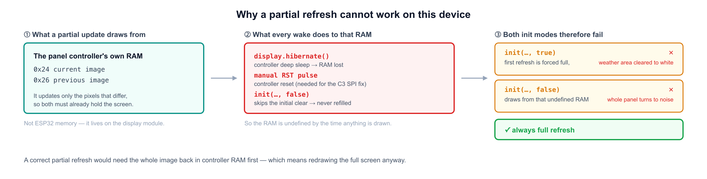

[English](persistence-and-refresh.md) | [한국어](persistence-and-refresh.ko.md)

# 저장과 화면 갱신

딥슬립 웨이크 = 완전 리셋. `setup()`부터 다시 시작하고 일반 RAM은 사라지며, 패널 컨트롤러도 리셋된
상태로 올라옴. 여기서 두 가지가 결정됨 — 마지막 성공 응답은 **RTC 메모리가 아니라 NVS(플래시)**에
두고, 화면은 **부분 갱신이 아니라 항상 전체 갱신**으로 다시 그림.

두 결정의 전제가 되는 요구사항: Wi-Fi나 fetch가 실패해도 화면엔 마지막 날씨 + **이번 웨이크**의 상태
(`offline`, 신호 게이지)가 떠 있어야 함.

갱신 시간과 전류는 이 하드웨어(ESP32-C3 + 1.54" SSD1681 패널) 기준이고 표에 표시함. 아래 GxEPD2
동작은 보드와 무관.

관련: [NVS에 상태 저장하기](nvs-internals.ko.md).

---

## 1. 상태줄도 전체 갱신으로 그림

부분 갱신은 **차분(differential)** 방식 — 직전 이미지와 다른 픽셀만 구동하므로, 현재 화면이 패널
컨트롤러 자체 RAM에 이미 들어 있어야 함. 이 RAM은 **ESP32 메모리가 아니라** 디스플레이 모듈 위에
있음. 매 웨이크가 그 RAM을 미정의 상태로 만들기 때문에 `init()`의 두 모드가 모두 깨짐.



설치된 GxEPD2 소스가 두 모드를 그대로 기술함:

```cpp
// GxEPD2_154_D67.cpp:274 — refresh(x, y, w, h)
if (_initial_refresh) return refresh(false);   // initial update needs be full update
```

`init(bitrate)`(= `init(bitrate, true)`)는 `_initial_refresh = true`로 두므로, 첫
`refresh(x, y, w, h)`가 조용히 전체 갱신(`_Update_Full()`)으로 바뀌고 부분 창은 버려짐.

```
// GxEPD2_BW.h:320
// NOTE: garbage will result on fast partial update displays,
//       if initial full update is omitted after power loss
```

`init(…, false)`는 그 초기 전체 갱신을 건너뛰므로, `_Update_Part()`가 웨이크가 미정의로 만든 RAM으로
패널 전체를 구동함.

이 패널에서의 관측 — `init(…, false)` 뒤 하단 ~22px에 `setPartialWindow()`:


### 득실

| | 갱신 시간 *(이 패널)* | 전제 조건 |
|---|---|---|
| 부분 갱신 | 0.5초 | 컨트롤러 RAM에 현재 이미지 전체가 이미 들어 있을 것 |
| **전체 갱신** | 2.6초 | 없음 |

매 웨이크마다 컨트롤러가 리셋되는 기기는 그 전제를 만족시킬 수 없음 → **항상 전체 갱신**.

---

## 2. 마지막 응답은 RTC 메모리가 아니라 NVS(플래시)에

fetch 실패 시 직전 날씨를 다시 그리려면 마지막 성공 응답이 웨이크를 넘어 살아 있어야 함. RTC SRAM은
딥슬립만 버팀. NVS는 이 기기가 겪는 모든 리셋을 버팀.

| | `RTC_DATA_ATTR` (RTC SRAM) | **NVS (플래시)** |
|---|---|---|
| 딥슬립 웨이크 | 유지 | 유지 |
| 리셋 버튼 / `ESP.restart()` | **소실** | 유지 |
| 전원 차단, 배터리 교체 | **소실** | 유지 |
| 펌웨어 재업로드 | **소실** | 유지 (NVS 파티션은 안 건드림) |
| 접근 | 변수 직접 사용, 복사 불필요 | `Preferences` get/put |

리셋 버튼과 재플래시는 개발 중 일상이고, 그때마다 RTC 메모리는 비워져 화면에 다시 그릴 내용이
남지 않음.

### 전력 비용

NVS 쓰기는 깨어 있는 Wi-Fi 구간 옆에서 사라지는 수준:

| | 소비 *(이 보드)* |
|---|---|
| Wi-Fi 접속 + HTTPS | ~80–120 mA × 1–4초 ← 지배적 |
| e-Paper 전체 갱신 | ~10 mA × 2.6초 |
| **NVS 쓰기** | ~15 mA × ~10 ms (≈ 0.04 mAs) |
| 딥슬립 (둘 다 동일) | ~5 µA — 웨이크 타이머 때문에 RTC 도메인은 어차피 켜져 있음 |

### 플래시 수명

NVS는 페이지에 엔트리를 추가하다가 페이지가 찰 때만 지우고, **값이 같으면 쓰기 자체를 건너뜀.**
이 웨이크 주기에서 erase 예산은 한계 근처에도 못 감:

| | |
|---|---|
| NOR 내구성 | 섹터당 약 10만 회 erase |
| 쓰기 | 10분에 1회 ≈ 연 52,500회 |
| 값 크기 | ~100바이트 |
| `nvs` 파티션 | ~20KB (기본) |
| 섹터 erase | 연 수백 회 |
| **여유** | **수십 년** |

초 단위 주기로 내릴 때부터 신경 쓸 문제가 됨. 엔트리 단위 계산:
[NVS에 상태 저장하기](nvs-internals.ko.md) §6.

---

## 3. 최종 흐름

```cpp
WifiResult wifi = connectWiFi();               // 1회 + 재시도 1회, 재부팅 루프 없음

String fetched;
if (wifi.ok) fetched = httpGet(WEATHER_URL);   // 1회 + 재시도 1회 (서버 콜드스타트 대비)

// NVS가 단일 소스: 새 값이 있으면 저장하고, 화면은 항상 저장된 값을 그림
prefs.begin("weather", false);
if (fetched.length()) prefs.putString("last", fetched);
String w = prefs.getString("last", "");
prefs.end();

displayBegin();                                // 항상 다시 그림 (전체 갱신)
displayWeather(w, wifi.ok ? wifi.ms : 0,       // 0 ms  -> "offline"
                  wifi.ok ? wifi.rssi : 0);    // 0 dBm -> 빈 게이지
```

| 상황 | 화면 |
|---|---|
| Wi-Fi ✓ fetch ✓ | 새 날씨 + 접속 시간 + 신호 게이지 |
| Wi-Fi ✓ fetch ✗ | 직전 날씨(NVS) + 접속 시간 + 게이지 |
| Wi-Fi ✗ | 직전 날씨(NVS) + `offline` + 빈 게이지 |
| 저장된 값 없음 | 빈 테두리 + `offline` |

상태줄은 항상 **이번 웨이크**를 반영하므로, 오래된 화면인지 방금 갱신된 화면인지 구분됨.
