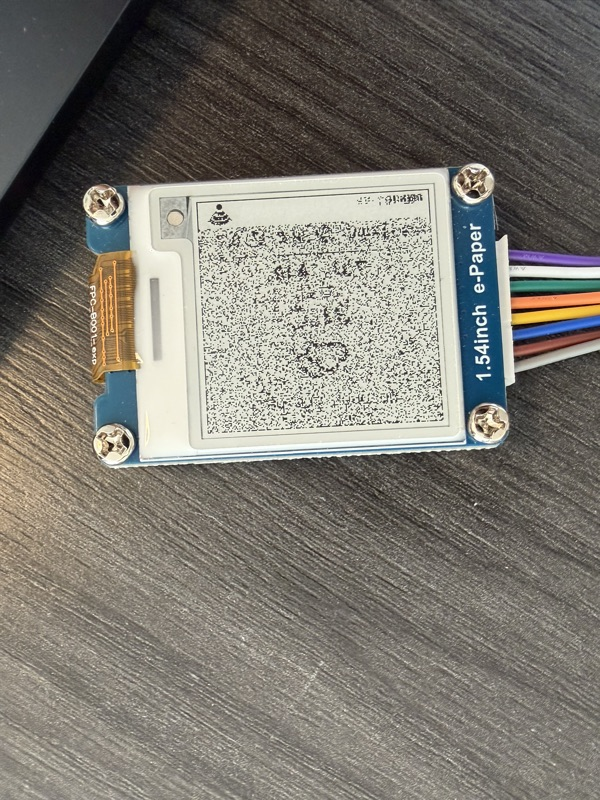

[English](persistence-and-refresh.md) | [한국어](persistence-and-refresh.ko.md)

# 저장과 화면 갱신 노트

마지막 날씨를 **RTC 메모리 대신 NVS(플래시)**에 두는 이유, 그리고 상태줄을 **부분 갱신이 아닌
전체 갱신**으로 그리는 이유.

전제: 웨이크 = 완전 리셋(딥슬립). Wi-Fi나 fetch가 실패해도 화면엔 **마지막 날씨 + 현재 상태**
(`offline`, 신호 게이지)가 떠 있어야 함.

---

## 1. 상태줄만 부분 갱신하면 안 되는 이유

계획: 날씨 영역은 그대로 두고, 하단 ~22px만 `setPartialWindow()`로 갱신. 실제 결과:



갱신을 요청한 strip이 아니라 **패널 전체**가 노이즈가 됨.

### 드라이버가 실제로 하는 일

설치된 GxEPD2에서 두 가지가 각각 깨뜨림:

**a) `init(..., initial=true)`는 부분 창을 무시함**

```cpp
// GxEPD2_154_D67.cpp:274 — refresh(x, y, w, h)
if (_initial_refresh) return refresh(false);   // initial update needs be full update
```

`init(bitrate)`(= `init(bitrate, true)`)는 `_initial_refresh = true`로 두므로, 첫
`refresh(x,y,w,h)`가 **조용히 전체 갱신**(`_Update_Full()`)으로 바뀜. 부분 창은 버려짐.
→ 날씨 영역이 하얗게 지워진 원인.

**b) `init(..., initial=false)`는 쓰레기 RAM을 기준으로 갱신함**

부분 갱신은 **차분(differential)** 방식이라, `_Update_Part()`가 컨트롤러 RAM
(0x24 "current" / 0x26 "previous")을 기준으로 패널을 구동함. 이 RAM은 **ESP32 메모리가 아니라**
디스플레이 모듈의 SSD1681 안에 있는데, 우리는 매 웨이크마다 그걸 날림:

- `display.hibernate()` → 컨트롤러를 딥슬립(`0x10`/`0x01`)으로 보냄 → RAM 소실
- `displayBegin()`의 수동 RST 펄스 (C3 SPI 핀 충돌 회피에 필요) → 컨트롤러 리셋
- `init(..., false)`는 초기 clear를 일부러 건너뜀 → 그 RAM을 채우지 않음

그래서 strip만 써넣으면 그 바깥은 전부 미정의 값이고, 갱신은 그 미정의 RAM으로 패널 전체를
구동함 → 위 사진.

라이브러리도 이 실패를 그대로 경고함:

```
// GxEPD2_BW.h:320
// NOTE: garbage will result on fast partial update displays,
//       if initial full update is omitted after power loss
```

### 결론

제대로 된 부분 갱신을 하려면 **컨트롤러 RAM 전체**에 현재 이미지가 먼저 들어 있어야 함
= 어차피 전체 화면을 다시 그린 뒤 strip만 refresh하는 셈. 갱신 시간(0.5초 vs 2.6초)은 줄지만,
**딥슬립 기기가 매 웨이크마다 리셋하는 컨트롤러 상태**에 의존하게 됨. 이 프로젝트엔 손해 →
**항상 전체 갱신**.

---

## 2. RTC 메모리가 아니라 NVS(플래시)인 이유

fetch 실패 시 직전 날씨를 다시 그리려면 마지막 성공 응답이 웨이크를 넘어 살아있어야 함. 선택지 둘:

| | `RTC_DATA_ATTR` (RTC SRAM) | **NVS (플래시)** |
|---|---|---|
| 딥슬립 웨이크 | 유지 | 유지 |
| 리셋 버튼 / `ESP.restart()` | **소실** | 유지 |
| 전원 차단, 배터리 교체 | **소실** | 유지 |
| 펌웨어 재업로드 | **소실** | 유지 (NVS 파티션은 안 건드림) |
| 접근 | 변수 직접 사용, 복사 불필요 | `Preferences` get/put |

RTC 메모리는 **딥슬립만** 버팀. 개발 중엔 리셋·재플래시로 매번 지워지는데, 화면이 비던 게 정확히
그 순간이었음. NVS는 전부 살아남음.

### 비용

전류는 사실상 동일. 깨어 있는 Wi-Fi 구간이 모든 걸 지배함:

| | 소비 |
|---|---|
| Wi-Fi 접속 + HTTPS | ~80–120 mA × 1–4초 ← 지배적 |
| e-Paper 전체 갱신 | ~10 mA × 2.6초 |
| **NVS 쓰기** | ~15 mA × ~10 ms (≈ 0.04 mAs) |
| 딥슬립 (둘 다 동일) | ~5 µA — 웨이크 타이머 때문에 RTC 도메인은 어차피 켜져 있음 |

### 플래시 수명

NOR 플래시는 섹터당 약 10만 회 지우기를 견디고, NVS는 페이지에 엔트리를 **추가**하다가 페이지가
찰 때만 지움. 게다가 **값이 같으면 쓰기를 건너뜀**.

10분에 1회(연 ~52,500회), 값 ~100바이트, 기본 ~20KB NVS 파티션 기준 → 섹터당 연 수백 회 지우기
= **수십 년 여유**. 초 단위 주기로 내릴 때만 신경 쓰면 됨.

---

## 3. 최종 흐름

```cpp
WifiResult wifi = connectWiFi();               // 1회 + 재시도 1회, 재부팅 루프 없음

String fetched;
if (wifi.ok) fetched = httpGet(WEATHER_URL);   // 1회 + 재시도 1회 (서버 콜드스타트 대비)

// NVS가 단일 소스: 새 값이 있으면 저장하고, 화면은 항상 저장된 값을 그림
prefs.begin("weather", false);
if (fetched.length()) prefs.putString("last", fetched);
String w = prefs.getString("last", "");
prefs.end();

displayBegin();                                // 항상 다시 그림 (전체 갱신)
displayWeather(w, wifi.ok ? wifi.ms : 0,       // 0 ms  -> "offline"
                  wifi.ok ? wifi.rssi : 0);    // 0 dBm -> 빈 게이지
```

| 상황 | 화면 |
|---|---|
| Wi-Fi ✓ fetch ✓ | 새 날씨 + 접속 시간 + 신호 게이지 |
| Wi-Fi ✓ fetch ✗ | 직전 날씨(NVS) + 접속 시간 + 게이지 |
| Wi-Fi ✗ | 직전 날씨(NVS) + `offline` + 빈 게이지 |
| 저장된 값 없음 | 빈 테두리 + `offline` |

상태줄은 항상 **이번 웨이크**를 반영하므로, 오래된 화면인지 방금 갱신된 화면인지 구분됨.
